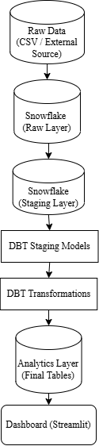
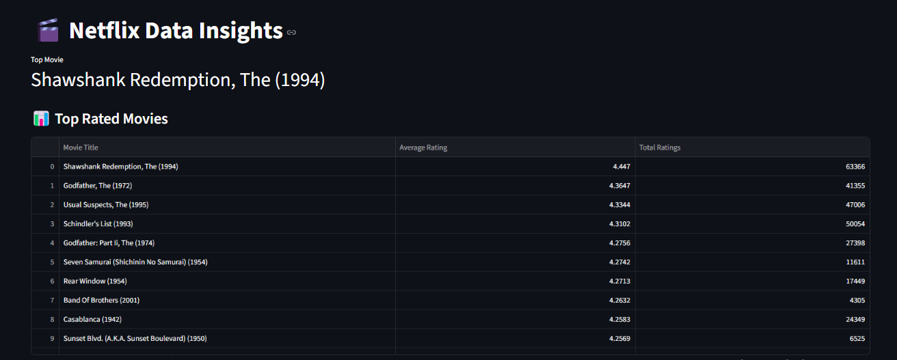
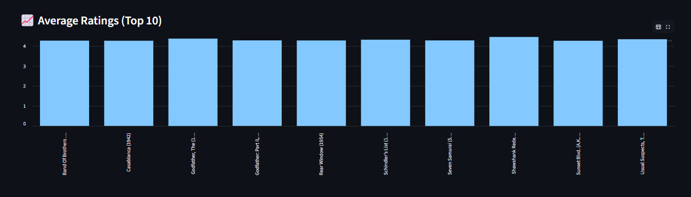

# 🎬 Modern Data Pipeline using AWS S3, Snowflake, dbt & Streamlit

## 🚀 Overview

This project demonstrates an **end-to-end data pipeline** built using **AWS S3, Snowflake, and dbt**, along with a **Streamlit dashboard** for visualization.

Raw data is ingested from S3, transformed into structured datasets using dbt, and visualized to generate meaningful insights.

---

## 🧠 Problem Statement

Modern platforms like Netflix generate large volumes of data (movies, ratings, tags).
The goal of this project is to:

* Ingest raw data from a data lake (S3)
* Transform and clean data
* Build scalable data models
* Ensure data quality
* Generate business insights

---

## 🏗️ Architecture



---

## ☁️ Data Ingestion (AWS S3)

Raw dataset is stored in an AWS S3 bucket and loaded into Snowflake using external stages.

* Created external stage in Snowflake
* Connected S3 using secure credentials
* Loaded CSV files into RAW tables using `COPY INTO`

This simulates a real-world data ingestion pipeline.

---

## ⚙️ Tech Stack

* AWS S3 (Data Lake)
* Snowflake (Cloud Data Warehouse)
* dbt (Data Transformation Tool)
* SQL
* Python (Streamlit, Pandas)

---

## 🔄 Data Pipeline Flow

1. Raw data stored in AWS S3
2. Loaded into Snowflake RAW layer
3. Staging models clean and standardize data
4. Transformation models build dimension and fact tables
5. dbt tests ensure data quality and integrity
6. Final analytics tables are generated
7. Insights visualized using Streamlit dashboard

---

## 🧪 Data Quality Checks

Implemented using dbt:

* `not_null` → Ensures no missing values
* `unique` → Enforces primary key constraints
* `relationships` → Maintains referential integrity

---

## 📊 Data Models

### 🔹 Dimension Tables

* dim_movies
* dim_users
* dim_genome_tags

### 🔹 Fact Tables

* fct_ratings
* fct_genome_scores

---

## 📈 Analysis & Insights

* Top rated movies based on user ratings
* High-engagement movies (based on rating counts)
* Average rating trends across movies

---

## 📊 Dashboard (Streamlit)

### 🔹 Table & Metrics



### 🔹 Charts



---

## 📂 Project Structure

```
netflixdbt/
 ├── netflix_project/        # dbt project
 │    ├── models/
 │    ├── seeds/
 │    ├── snapshots/
 │    ├── analyses/
 │    ├── macros/
 │    ├── tests/
 │    ├── dbt_project.yml
 │    ├── packages.yml
 │
 ├── data/                  # CSV for dashboard
 │    └── sample_output.csv
 │
 ├── app.py                 # Streamlit dashboard
 ├── architecture.png
 ├── dashboard1.png
 ├── dashboard2.png
 ├── README.md
```

---

## 🚀 Key Highlights

* Built an end-to-end data pipeline using AWS S3, Snowflake, and dbt
* Ingested data from S3 into Snowflake using external stages
* Designed modular transformations (staging → dim → fact → mart)
* Implemented data quality validation using dbt tests
* Generated analytics-ready datasets for insights
* Developed a Streamlit dashboard for visualization

---

## 🧑‍💻 Author

**Utkarsh Tyagi**
